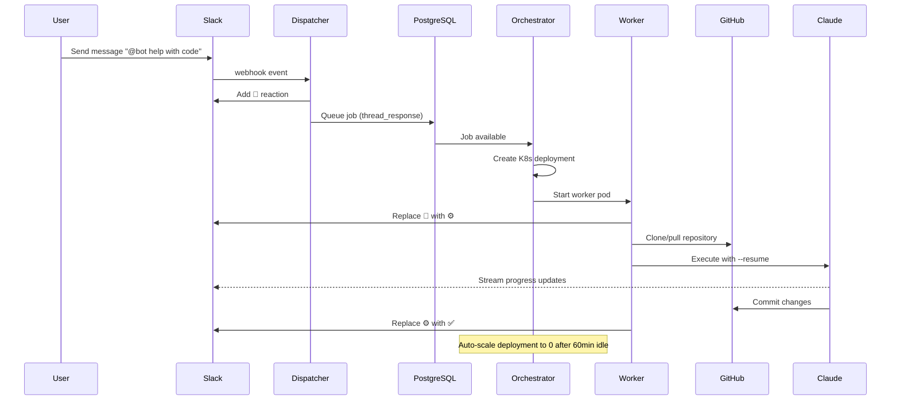
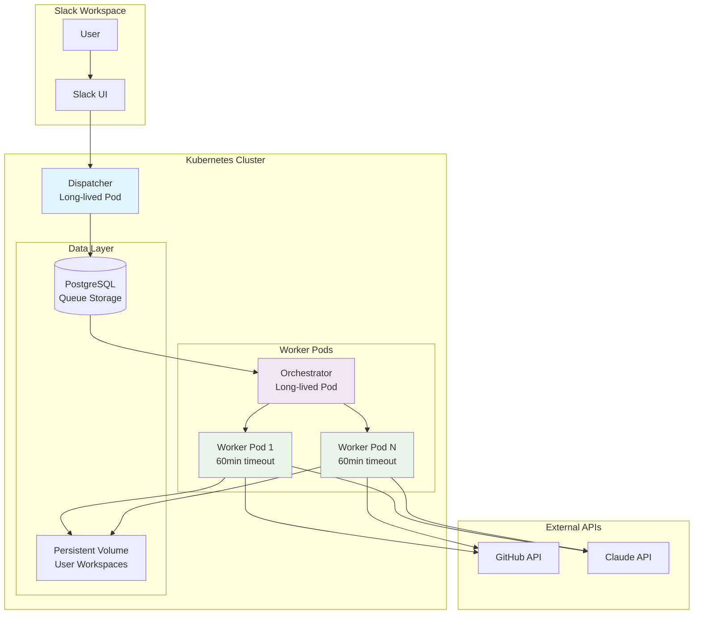

# Peerbot Architecture

## Overview

Peerbot is a Kubernetes-native Slack bot that provides AI-powered coding assistance. It uses a scalable dispatcher-orchestrator-worker pattern with persistent storage for conversation continuity.

## Core Modules

### 🚀 Dispatcher ([`packages/dispatcher/`](packages/dispatcher/))

**Responsibilities**: Slack integration, session management, job queuing

- **Socket listener**: [`src/index.ts`](packages/dispatcher/src/index.ts) - Main Slack app server that connects to Slack via Socket Mode
- **Event Handling**: [`src/slack/slack-event-handlers.ts`](packages/dispatcher/src/slack/slack-event-handlers.ts) - Processes Slack messages/interactions and handles Markdown conversions
- **Repository Management**: [`src/github/repository-manager.ts`](packages/dispatcher/src/github/repository-manager.ts) - GitHub repository operations

### ⚡ Orchestrator ([`packages/orchestrator/`](packages/orchestrator/))

**Responsibilities**: Queue processing, Kubernetes worker lifecycle, deployment cleanup

- **Main Service**: [`src/index.ts`](packages/orchestrator/src/index.ts) - Queue consumer and service coordinator
- **Deployment Manager**: [`src/k8s/K8sDeploymentManager.ts`](packages/orchestrator/src/k8s/K8sDeploymentManager.ts) and [`src/docker/DockerDeploymentManager.ts`](packages/orchestrator/src/docker/DockerDeploymentManager.ts)
- **Queue Consumer**: [`src/task-queue-consumer.ts`](packages/orchestrator/src/task-queue-consumer.ts) - PostgreSQL/pgboss job processing

### 🔧 Worker ([`packages/worker/`](packages/worker/))

**Responsibilities**: Claude CLI execution, GitHub integration, progress streaming, MCP process management

- **Claude Integration**: [`src/claude-worker.ts`](packages/worker/src/claude-worker.ts) - Claude CLI execution and streaming
- **Queue Integration**: [`src/task-queue-integration.ts`](packages/worker/src/task-queue-integration.ts) - Job processing and status updates
- **MCP Process Server**: [`mcp/process-manager-server.ts`](packages/worker/mcp/process-manager-server.ts) - MCP-based process lifecycle management
- **Process Manager Integration**: [`src/process-manager-integration.ts`](packages/worker/src/process-manager-integration.ts) - HTTP streaming process manager startup and lifecycle

## Process Hierarchy

The worker process employs a hierarchical architecture to manage background processes and provide Claude with MCP (Model Context Protocol) tools for process management.

### Process Layers

```
Kubernetes Pod
├── Worker Main Process (Node.js)
│   ├── Queue Consumer (pgboss)
│   ├── MCP Process Manager HTTP Server (Express + SSE)
│   │   ├── Background Process 1 (e.g., dev server)
│   │   ├── Background Process 2 (e.g., build process)
│   │   └── Background Process N (with optional cloudflared tunnels)
│   └── Claude CLI Process
│       └── MCP Client Connection (HTTP/SSE to Process Manager)
```

### Process Manager Architecture

**HTTP Streaming Design**: The process manager runs as an integrated HTTP server within the worker process, using Server-Sent Events (SSE) for MCP communication.

- **Transport**: HTTP with SSE instead of stdio for better reliability and debugging
- **Port**: Configurable via `MCP_PROCESS_MANAGER_PORT` (default: 3001)
- **Endpoints**:
  - `GET /sse` - Establishes SSE connection for MCP clients
  - `POST /messages` - Handles MCP method calls and responses

**Process Management Features**:

- **Lifecycle Tracking**: Monitors process status (starting, running, completed, failed, killed)
- **Auto-restart**: Automatically restarts failed processes up to 5 times
- **Log Management**: Centralized logging to `/tmp/claude-logs/{process-id}.log`
- **Tunnel Integration**: Optional cloudflared tunnel support for web services
- **Persistent State**: Process information saved to `/tmp/agent-processes/{process-id}.json`

**Development Server with Tunnel**:

```
Claude → MCP → Process Manager → bun run dev (port 3000)
                                 ├── cloudflared tunnel → https://random.peerbot.ai
                                 └── Logs → /tmp/claude-logs/dev-server.log
```

**Build Process**:

```
Claude → MCP → Process Manager → bun run build
                                 └── Logs → /tmp/claude-logs/build.log
```

**Multi-Process Development**:

```
Claude → MCP → Process Manager → frontend (port 3000) + backend (port 8000)
                                 ├── frontend tunnel → https://app.peerbot.ai
                                 ├── backend tunnel → https://api.peerbot.ai
                                 └── Centralized log monitoring
```

## Queue System

### Database Structure

- **Instance**: Single PostgreSQL StatefulSet (8Gi storage) - [Config](charts/peerbot/templates/postgresql-statefulset.yaml)
- **Queue Library**: pgboss for reliable job queuing
- **RLS**: Row Level Security to prevent cross-deployment access with separate user credentials in Postgresql - [Schema](db/migrations/001_initial_schema.sql)

### Queues

1. **`thread_response`**: User messages in Slack threads/channels
2. **`direct_message`**: Direct messages to the bot
3. For each worker deployment **`thread_message_{deploymentId}`**: Each conversation thread gets its own isolated queue, combined with RLS policies to prevent cross-thread access

## User Message Flow



## Architecture Diagram



## Session Persistence

### How Conversations Continue

1. **Persistent Volume**: Single 10GB PVC shared across all workers
2. **User Isolation**: Each user gets `/workspace/user-{username}/` directory
3. **Claude Sessions**: All conversation history stored in `.claude/` subdirectory
4. **Auto-Resume**: Workers use `claude --resume <session-id>` to continue conversations
5. **No Data Loss**: Data persists even when worker pods terminate

### Background Process Management

Workers include a background process management MCP server.

### Directory Structure

```
/workspace/                     # PVC mount point (K8s) or local workspaces dir (Docker)
├── U095ZLHKP98/               # Per-userId directory
│   ├── 1756492073.980799/     # Per-thread workspace (threadId/timestamp)
│   │   ├── .git/              # Cloned repository
│   │   ├── .claude/           # Claude session data (auto-resume support)
│   │   │   ├── projects/      # Project context
│   │   │   └── sessions/      # Conversation history
│   │   └── [project files]    # User's code from repository
│   └── 1756491379.629309/     # Another thread workspace
│       ├── .git/
│       ├── .claude/
│       └── [project files]
└── U09513HH1N1/               # Another user's workspace
    ├── 1756479858.121779/     # Thread-specific workspace
    │   ├── .git/
    │   ├── .claude/
    │   └── [project files]
    └── 1756491388.020389/     # Another thread workspace
        ├── .git/
        ├── .claude/
        └── [project files]
```

## Deployment Management

### Worker Lifecycle

- **Creation**: Orchestrator creates Kubernetes deployment per conversation thread
- **Scaling**: Deployments start with 1 replica, scale to 0 after 60 minutes idle
- **Cleanup**: Idle worker cleanup runs every minute, removes deployments idle >60min
- **Persistence**: User data remains in PVC even after pod deletion - [Storage Config](charts/peerbot/templates/worker-pvc.yaml)

**Container Images:**

- **Dispatcher**: [`Dockerfile.dispatcher`](Dockerfile.dispatcher)
- **Orchestrator**: [`Dockerfile.orchestrator`](Dockerfile.orchestrator)
- **Worker**: [`Dockerfile.worker`](Dockerfile.worker)

### Idle Worker Cleanup Process

The orchestrator automatically cleans up idle worker deployments to prevent resource accumulation:

1. **Cleanup Schedule**: Runs every minute via `setInterval`
2. **Idle Detection**: SQL query identifies deployments with no activity for >60 minutes:
   ```sql
   SELECT deployment_id, user_id, last_activity,
          EXTRACT(EPOCH FROM (NOW() - last_activity))/60 as minutes_idle,
          COUNT(*) as message_count
   FROM pgboss.job
   WHERE name = 'thread_response'
     AND last_activity < NOW() - INTERVAL '60 minutes'
   GROUP BY deployment_id, user_id
   ```
3. **Resource Cleanup**: For each idle deployment, removes:
   - Kubernetes Deployment: `peerbot-worker-{deploymentId}`
   - PersistentVolumeClaim: `peerbot-workspace-{deploymentId}` (if exists)
   - Kubernetes Secret: `peerbot-user-secret-{username}`
4. **Logging**: Detailed logs show which deployments were cleaned up and why

### PostgreSQL User Management & RLS

Each worker gets isolated database access through dedicated PostgreSQL users:

#### User Creation Process

1. **Username Generation**: `slack_{workspaceId}_{userId}` (lowercase)
2. **Password**: 32-character random string (URL-safe characters)
3. **Database User**: Created with pgboss schema permissions:
   ```sql
   CREATE USER "slack_workspace_user123" WITH PASSWORD 'randompassword';
   GRANT USAGE ON SCHEMA pgboss TO "slack_workspace_user123";
   GRANT ALL ON ALL TABLES IN SCHEMA pgboss TO "slack_workspace_user123";
   ```
4. **Kubernetes Secret**: Credentials stored in `peerbot-user-secret-{username}`

#### Row Level Security (RLS)

Database queries execute with user context for access control:

```sql
-- Set user context before queries
SELECT set_config('app.current_user_id', $1, true);
-- RLS policies can now filter based on current_setting('app.current_user_id')
```

This ensures workers can only access their own thread messages and user data.

## Status Indicators

| Emoji | Status     | Description                                                                         |
| ----- | ---------- | ----------------------------------------------------------------------------------- |
| ⚙️    | Processing | The deployment is active, processing user's request or running background processes |
| ✅    | Complete   | Task completed successfully                                                         |
| ❌    | Failed     | Error during execution                                                              |
| ⏳    | Timeout    | Job exceeded time limit                                                             |

## Rate Limiting & Security

- **Rate Limits**: 5 jobs per user per 15 minutes
- **Pod Security**: Non-root containers, read-only filesystem except `/workspace`
- **Network**: Workers access only GitHub and Claude API - [Network Policy](charts/peerbot/templates/network-policy.yaml)
- **Secrets**: Kubernetes secrets for API tokens, mounted as volumes - [Secret Template](charts/peerbot/templates/secrets.yaml)

## Development & Testing

- **Local Setup**: [make setup](Makefile) - Interactive configuration wizard
- **Development Mode**: [`make dev`](Makefile) - Hot reload with Docker
- **QA Testing**: [`slack-qa-bot.js`](slack-qa-bot.js) - Automated bot testing tool
- **Kubernetes Deployment**: [`make k8s-install`](Makefile) - Deploy to K8s cluster
