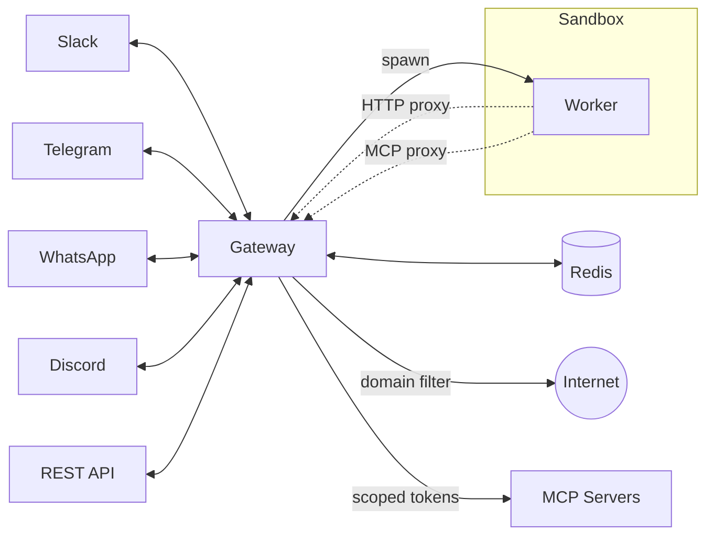

# Lobu - Multi-tenant OpenClaw for Organizations

**Lobu** is an open-source multi-tenant gateway for [OpenClaw](https://github.com/openclaw/openclaw). One sandbox and filesystem per user/channel. Shared memory across contexts. Agents never see secrets.

OpenClaw is an incredible agent runtime (800k LOC) but it's [single-tenant by design](https://x.com/steipete/status/2026092642623201379). Every user shares the same filesystem and bash session. Lobu rewrites only the gateway layer (~40k LOC) to be multi-tenant and keeps OpenClaw's Pi agent harness untouched inside each worker.

**Embedded mode** uses [just-bash](https://github.com/nicholasgasior/just-bash) (virtual bash) + Nix for reproducible packages. Each user gets an isolated virtual filesystem and bash session at ~50MB memory footprint. We've tested 300 concurrent instances on a single machine. No Docker needed.

Embed OpenClaw-powered agents into your product, or give your team powerful agents without managing separate instances for everyone.

https://github.com/user-attachments/assets/d72a9286-0325-4b8b-afc0-c1efe9c96f4e

## Channels & API

**REST API** — Programmatic agent creation, control, and state management.

[](https://community.lobu.ai/api/docs)

**Slack** — Multi-channel/DM agents with rich interactivity.

**Telegram** — Long-polling bot integration with interactive agent workflows.

**WhatsApp** — WhatsApp Business Cloud API integration.

**Discord** — Bot integration with channel and DM support.

**Teams** — Microsoft Teams bot integration.

## Quick Start

### Self-host in under a minute

The quickest way to start is the CLI scaffold:

```bash
npx @lobu/cli@latest init my-bot
cd my-bot && npx @lobu/cli@latest run -d
```

### Deployment modes

- **Docker Compose** — `docker compose up` (One-click, production single-machine)
- **Kubernetes** — Install via OCI Helm chart (no clone needed):

```bash
helm install lobu oci://ghcr.io/lobu-ai/charts/lobu \
  --namespace lobu \
  --create-namespace
```

- **Local Development** — For contributing to Lobu itself:
  1. Clone this repo
  2. `make setup`
  3. `make dev` (Uses Docker Compose Watch for hot-reloading)

## Architecture



## Capabilities

Every Lobu agent comes equipped with a suite of tools for autonomous execution and persistence:

| Feature | Description | Built-in Tools |
| :--- | :--- | :--- |
| **Autonomous Scheduling** | Schedule one-time or recurring execution via cron. | `ScheduleReminder`, `ListReminders`, `CancelReminder` |
| **Human-in-the-Loop** | Pause for user input via buttons and resume when answered. | `AskUserQuestion` |
| **Full Linux Toolbox** | Sandboxed shell access, file editing, and advanced search. | `bash`, `read`, `write`, `edit`, `grep`, `find`, `ls` |
| **Conversation Context** | Pull earlier thread messages when the user references prior work. | `GetChannelHistory` |
| **File & Media Delivery** | Share reports, charts, or generated voice messages. | `UploadUserFile`, `GenerateAudio` |
| **Skills** | Extend agent capabilities via skills configured in lobu.toml or the admin settings page. | `lobu.toml`, Settings UI |
| **Connected APIs** | Access third-party APIs (GitHub, Google, etc.) through Owletto MCP tools with managed OAuth. | MCP tools via Owletto |
| **Managed MCP Proxy** | Securely connect to any MCP server with secret injection. | [MCP Proxy](docs/SECURITY.md#credentials) |
| **Advanced Capabilities** | Extend agent abilities with web browsing, headless UI interaction, and specialized utilities via Nix packages or external MCP servers. | `bash` (Nix), MCP servers |

### Popular MCP Integrations
Workers access third-party APIs through MCP servers. OAuth and credential management is handled by Owletto:
- **Productivity:** Google Calendar, Slack, Jira, Notion
- **Development:** GitHub, GitLab, Postgres, Docker
- **Knowledge:** Wikipedia, Brave Search, YouTube, PDF Search

**Gateway as single egress.** All worker traffic — internet and MCP — routes through the gateway. Workers have no direct network access. Domain filtering controls which external services workers can reach.

**MCP Proxy.** Workers call MCP tools via the gateway. The gateway resolves `${env:VAR}` secrets and routes to upstream MCP servers. OAuth credentials for third-party APIs are managed by Owletto — workers never see tokens directly.

**Multi-platform, multi-tenant.** One bot instance serves Slack, Telegram, WhatsApp, Discord, Teams, and REST API. Each channel/DM gets its own isolated runtime, model, tools, credentials, and Nix packages.

**OpenClaw runtime.** Workers run [OpenClaw Pi Agent](https://openclaw.ai/), with per-agent model selection via the settings page. Supports OpenClaw skills, `IDENTITY.md`, `SOUL.md`, and `USER.md` workspace files.

**Multi-provider auth.** 16 LLM providers (OpenAI, Gemini, Groq, DeepSeek, Mistral, etc.) via config-driven provider registry. API keys resolved at the gateway — workers never see credentials.

## How Lobu Differs

Lobu is the **infrastructure layer** for autonomous agents. Unlike frameworks (LangChain, CrewAI) that help you *write* agent logic, Lobu is the **delivery mechanism** that runs those agents at scale — handling the sandboxing, persistence, and messaging connectivity.

| | Lobu | OpenClaw |
|---|---|---|
| **Scale to zero** | Workers scale down when idle | Requires always-on computer |
| **Multi-tenant** | Single bot, per-channel/DM isolation | One instance per setup |
| **Multi-platform** | Slack, Telegram, WhatsApp, Discord, Teams, REST API | [15+ chat platforms](https://openclaw.ai/integrations) |
| **Runtime** | OpenClaw engine (sandboxed/proxied) | Native OpenClaw runtime |
| **User onboarding** | Configure page with OAuth login per provider | CLI setup required |
| **MCP access** | Proxied through gateway, secrets isolated | Direct from agent |
| **Network isolation** | Workers sandboxed, domain-filtered egress | No built-in isolation |
| **Deployment** | K8s, Docker | Single node |

## Security and Privacy

- [**No direct worker egress**](docs/SECURITY.md#network-egress) — all traffic routes through the gateway proxy.
- [**Secrets stay in gateway**](docs/SECURITY.md#credentials) — Provider credentials and `${env:}` substitution. OAuth for third-party APIs managed by Owletto.
- [**Defense-in-depth on K8s**](docs/SECURITY.md#kubernetes) — NetworkPolicies, RBAC, and optional gVisor/Kata runtimes.
- [**Nix system packages**](docs/SECURITY.md#skills-and-policy) — per-agent reproducible tooling and skills policy enforcement.

## Support & Consultancy

Lobu is designed for high-stakes, persistent agents. While the platform is open-source, the true value of an agent lies in its **soul, identity, and integration**.

If you want to deploy agents for your organization but need expert implementation and infrastructure maintenance, I provide end-to-end support for:

*   **Employee AI Assistants** — Deploy persistent, sandboxed agents across Slack that have access to your internal tools and documentation.
*   **Automated Customer Support** — Build agents that handle complex, multi-step support tickets autonomously while keeping a human in the loop.
*   **Autonomous Workflows** — Use Lobu to automate background tasks that require persistent state, long-running execution, and scheduled cron jobs.
*   **Infrastructure Maintenance** — Let me manage your private Lobu deployment on your own Kubernetes cluster, ensuring 99.9% uptime, security updates, and automated scaling.
*   **Custom Tooling & Skills** — I build specialized MCP servers, Nix-powered runtimes, and OpenClaw skills tailored to your business needs.

---

**Expert Implementation.** I'm a second-time technical founder. Previously, I founded [rakam.io](https://rakam.io), an enterprise analytics PaaS acquired by [LiveRamp](https://liveramp.com) (NYSE: RAMP). I help organizations move beyond chatbots by building the secure, scalable infrastructure required for production-grade autonomous agents.

> [!TIP]
> **Interested in launching persistent agents for your team or customers?** I'm happy to help you architect a reliable deployment for your specific use case. [🗓️ **Talk to Founder**](https://calendar.app.google/LwAk3ecptkJQaYr87) or [reach out on **X/Twitter**](https://x.com/bu7emba).
