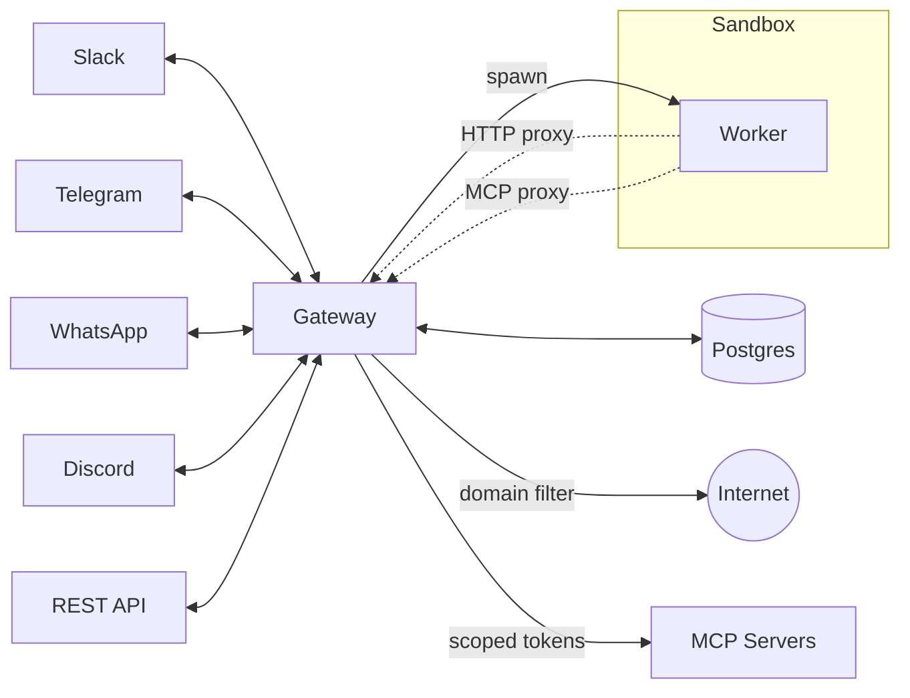

# Lobu — Multi-tenant OpenClaw for Organizations

**Lobu** is an open-source multi-tenant gateway for [OpenClaw](https://github.com/openclaw/openclaw). One sandbox and filesystem per user/channel. Shared memory across contexts. Agents never see secrets.

OpenClaw is a full agent runtime (~800k LOC) but it's [single-tenant by design](https://x.com/steipete/status/2026092642623201379) — every user shares the same filesystem and bash session. Lobu rewrites only the gateway layer (~40k LOC) to be multi-tenant and keeps OpenClaw's Pi harness untouched inside each worker.

**Embedded mode** uses [just-bash](https://github.com/nicholasgasior/just-bash) + Nix for reproducible packages. Each user gets an isolated virtual filesystem and bash session at ~50MB per instance — tested at 300 concurrent instances on a single machine, no Docker needed.

Embed OpenClaw-powered agents into your product, or give your team agents without managing a separate instance per person.

https://github.com/user-attachments/assets/d72a9286-0325-4b8b-afc0-c1efe9c96f4e

## Channels & API

- **REST API** — programmatic agent creation, control, and state. [](https://lobu.ai/reference/api-reference/)
- **Slack** — multi-channel/DM agents with rich interactivity.
- **Telegram** — long-polling bot with interactive workflows.
- **WhatsApp** — WhatsApp Business Cloud API.
- **Discord** — channel + DM bot support.
- **Teams** — Microsoft Teams bot.

## Quick Start

Scaffold and run via the CLI. Lobu boots as a single Node process; you bring your own Postgres (pgvector required — managed instance or local via `brew services start postgresql`).

```bash
npx @lobu/cli@latest init my-bot
cd my-bot
# edit .env to set DATABASE_URL
npx @lobu/cli@latest run
```

## Starter Skills

Install the Lobu starter skill into any local `skills/` directory:

```bash
npx @lobu/cli@latest skills add lobu
```

The bundled Lobu starter skill includes memory guidance. Configure local MCP clients when needed:

```bash
npx @lobu/cli@latest memory init
```

### Deployment

Single-process Node app. Run it however you run Node — `node`, `pm2`, `systemd`, or another process supervisor. The app needs `DATABASE_URL` (Postgres + pgvector) reachable from its environment; no orchestrator is required and there is no Helm chart to install.

- **Local dev** (contributing to Lobu itself): clone, `make setup`, `make dev` (boots embedded gateway + workers + Vite HMR on `:8787`).
- **Production**: `bun run --cwd packages/owletto-backend build:server`, then `node packages/owletto-backend/dist/server.bundle.mjs` under your process supervisor of choice.

## Architecture



## Capabilities

Every Lobu agent ships with tools for autonomous execution and persistence:

| Feature | Built-in Tools |
| --- | --- |
| **Autonomous scheduling** — one-time or cron | `ScheduleReminder`, `ListReminders`, `CancelReminder` |
| **Human-in-the-loop** — pause on button input, resume on answer | `AskUserQuestion` |
| **Full Linux toolbox** — sandboxed shell, file edit, search | `bash`, `read`, `write`, `edit`, `grep`, `find`, `ls` |
| **Conversation context** — pull earlier thread messages | `GetChannelHistory` |
| **File & media delivery** — share reports, charts, audio | `UploadUserFile`, `GenerateAudio` |
| **Skills** — extend via `lobu.toml` or admin settings | `lobu.toml`, Settings UI |
| **Connected APIs** — GitHub, Google, etc. with Owletto-managed OAuth | MCP tools via Owletto |
| **Managed MCP proxy** — any MCP server with secret injection | [MCP Proxy](docs/SECURITY.md#credentials) |
| **Nix + external MCP** — browsing, headless UI, custom tools | `bash` (Nix), MCP servers |

### Popular MCP integrations

- **Productivity:** Google Calendar, Slack, Jira, Notion
- **Development:** GitHub, GitLab, Postgres, Docker
- **Knowledge:** Wikipedia, Brave Search, YouTube, PDF Search

### Design

- **Gateway as single egress.** All worker traffic — internet and MCP — routes through the gateway. Workers have no direct network access; domain filtering controls which services they reach.
- **MCP proxy.** Gateway resolves `${env:VAR}` secrets and routes to upstream MCP servers. OAuth for third-party APIs stays in Owletto — workers never see tokens.
- **Multi-platform, multi-tenant.** One instance serves Slack, Telegram, WhatsApp, Discord, Teams, and the REST API. Each channel/DM gets its own runtime, model, tools, credentials, and Nix packages.
- **OpenClaw runtime.** Workers run [OpenClaw Pi Agent](https://openclaw.ai/) with per-agent model selection. Supports OpenClaw skills and `IDENTITY.md` / `SOUL.md` / `USER.md` workspace files.
- **Multi-provider auth.** 16 LLM providers (OpenAI, Gemini, Groq, DeepSeek, Mistral, …) via a config-driven registry. API keys stay on the gateway.

## How Lobu Differs

Lobu is the **infrastructure layer** for autonomous agents. Frameworks like LangChain or CrewAI help you *write* agent logic; Lobu is the delivery layer that runs those agents at scale — sandboxing, persistence, and messaging connectivity.

| | Lobu | OpenClaw |
| --- | --- | --- |
| Scale to zero | Workers scale down when idle | Requires always-on machine |
| Multi-tenant | Single bot, per-channel/DM isolation | One instance per setup |
| Multi-platform | Slack, Telegram, WhatsApp, Discord, Teams, REST API | [15+ chat platforms](https://openclaw.ai/integrations) |
| Runtime | OpenClaw engine (sandboxed/proxied) | Native OpenClaw |
| Onboarding | Config page with per-provider OAuth | CLI setup |
| MCP access | Proxied through gateway, secrets isolated | Direct from agent |
| Network | Sandboxed, domain-filtered egress | No built-in isolation |
| Deployment | Single Node process (BYO Postgres) | Single node |

## Security and Privacy

- [**Worker egress through the gateway proxy**](docs/SECURITY.md#network-egress) — `HTTP_PROXY=http://localhost:8118` with allowlist/blocklist + LLM egress judge. On Linux production hosts the worker spawn uses `systemd-run --user --scope` with `IPAddressDeny=any` to enforce egress at the kernel level; in dev (macOS) the proxy is best-effort.
- [**Secrets stay in gateway**](docs/SECURITY.md#credentials) — provider credentials and `${env:}` substitution; OAuth lives in Owletto. Workers never see real keys.
- [**Threat model: single-tenant local isolation**](docs/SECURITY.md) — `just-bash` and `isolated-vm` are policy + best-effort sandboxes, not security boundaries for hostile code. See `docs/SECURITY.md` before exposing Lobu to untrusted users.
- [**Nix system packages**](docs/SECURITY.md#skills-and-policy) — per-agent reproducible tooling and skill policy.

## Support & Consultancy

Lobu is open source, but deploying production-grade agents usually means tuning soul, identity, and integrations. I offer hands-on implementation for:

- **Employee AI assistants** — persistent sandboxed agents on Slack wired into internal tools and docs.
- **Automated customer support** — multi-step ticket handling with human-in-the-loop.
- **Autonomous workflows** — long-running, scheduled background jobs with persistent state.
- **Managed infrastructure** — private Lobu deployments with updates and scaling.
- **Custom tooling & skills** — bespoke MCP servers, Nix runtimes, and OpenClaw skills.

I'm a second-time technical founder. Previously founded [rakam.io](https://rakam.io) (enterprise analytics PaaS), acquired by [LiveRamp](https://liveramp.com) (NYSE: RAMP).

> [!TIP]
> Want persistent agents for your team or customers? [Talk to Founder](https://calendar.app.google/LwAk3ecptkJQaYr87) or reach out on [X/Twitter](https://x.com/bu7emba).
