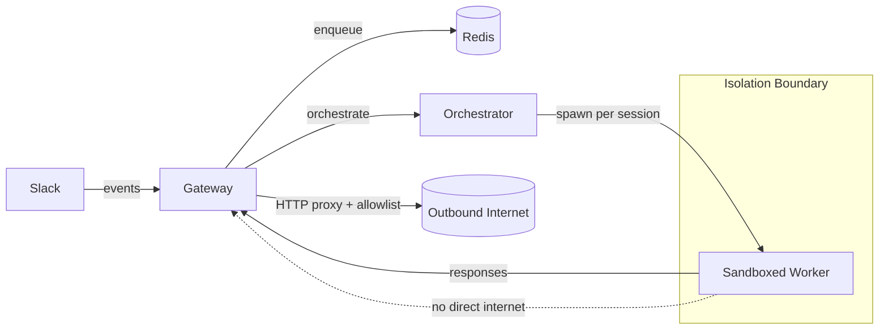

# Lobu

Join the Slack: https://join.slack.com/t/peerbot/shared_invite/zt-391o8tyw2-iyupjTG1xHIz9Og8C7JOnw

**Enterprise-ready, multi-tenant, sandboxed agent orchestration built on the OpenClaw runtime.** Lobu runs coding agents in isolated workers behind a hardened gateway so teams can use "agentic" workflows without putting a single laptop (or a flat network) in the blast radius.

Supported platforms: **Slack** (primary), **Telegram** (available).

## Motivation

OpenClaw is great at the "magic" part: the embedded agent runtime (tools, sessions, skills, and the agent loop). Securing a local, always-on gateway that can execute code and install third-party skills is hard.

Lobu keeps the OpenClaw runtime experience, but moves execution into **sandboxed, disposable workers** with **centralized secret management** and **network egress control**.

## How It Works



**Key concepts**
- **Session = workspace**: each Slack thread (and other contexts) maps to an isolated workspace with its own lifecycle.
- **Multi-tenant by default**: different channels/DMs can run different models, tools, skills, Nix environments, and credentials safely.
- **Agent abstraction**: per-context configuration controls runtime/model/tools so the bot behaves differently in different places.
- **Gateway as single egress point**: workers route outbound traffic through the gateway, which enforces domain policy.

More details: `ARCHITECTURE.md`

## Differences Vs OpenClaw

Lobu is **built on OpenClaw's embedded runtime**, but the control plane is designed for multi-tenant operation and stronger isolation.

- **Claude Code runtime (subscriptions)**: Lobu can run **Claude Code CLI** as a worker runtime, letting teams use Claude subscriptions and OAuth flows rather than managing raw API keys everywhere.
- **Server-side, multi-tenant gateway**: OpenClaw is typically "one gateway per machine / workspace". Lobu treats each context (channel, thread, DM) as a tenant-scoped environment with separated workspaces and scoped secrets.
- **Security-first execution model**: Lobu runs execution in sandboxed workers and keeps the gateway as the only component that can talk to external services directly.
- **Gateway scope**: OpenClaw's gateway implementation is substantial (as of commit `229376f`, `src/gateway` is ~29k TS LoC excluding tests). Lobu's gateway is architecturally different: it focuses on ingestion, policy, and orchestration, while work happens in workers.
- **Pi/skills ecosystem**: OpenClaw's harness is powered by pi-mono (pi-agent-core) and a growing set of CLIs. Lobu aims to make those capabilities safe to use in sandboxes via **skills** plus reproducible tooling via **Nix**.

OpenClaw references:
- Gateway: https://docs.openclaw.ai/cli/gateway
- Agent loop / embedded harness: https://docs.openclaw.ai/concepts/agent-loop
- pi-mono (harness + CLIs): https://github.com/badlogic/pi-mono

## Yet Another OpenClaw Copy?

I built and exited a B2B SaaS business (acquired by LiveRamp) and then started working on this full-time. Follow along: https://x.com/bu7emba

This project started in **July 2025** and was first published under **peerbot.ai**, initially focused on Claude Code. Peter's OpenClaw is more interesting long-term because it has a better harness (built on pi-mono) and an army of CLIs that make agents actually useful.

Lobu exists because the runtime is great, but enterprise-grade isolation, secrets, and egress control are non-trivial. The plan is to monetize via enterprise support so the project stays sustainable.

## Installation

This repo supports two installation methods:

### 1) Docker Compose (single host)

**Prereqs**: Docker Desktop, Slack app credentials, and a Claude Code OAuth token (or other configured model auth).

```bash
cp .env.example .env
# edit .env

# Build the worker image used for per-session sandboxes
make build-worker

# Start gateway + redis
docker compose up -d
docker compose logs -f gateway
```

Security model (Docker Compose): workers run on an internal Docker network with **no direct internet access**; outbound traffic goes through the gateway's HTTP proxy with domain filtering. See `SECURITY.md#docker-compose`.

### 2) Kubernetes (production)

**Prereqs**: `kubectl`, `helm`, and a cluster with a default StorageClass for per-session PVCs.

```bash
cp .env.example .env
# edit .env

make deploy
```

Security model (Kubernetes): workers run as isolated pods (optionally with stronger runtimes like **gVisor** on GCP or **Kata Containers** / microVMs where available), are not externally reachable, and route egress through the gateway proxy. See `SECURITY.md#kubernetes`.

## Security And Privacy (summary)

- **No direct worker egress**: workers route outbound HTTP(S) via the gateway proxy, which enforces domain policy (allowlist/blocklist). (`SECURITY.md#network-egress`)
- **Secrets stay in the gateway**: MCP OAuth flows and provider credentials are handled by the gateway; workers never see MCP client secrets. (`SECURITY.md#mcp-oauth-and-credentials`)
- **Defense-in-depth on Kubernetes**: NetworkPolicies, RBAC, resource limits/quotas, and optional gVisor/Kata. (`SECURITY.md#kubernetes`)
- **Nix environments**: per-session environments can be activated using Nix (flake/packages) inside workers for reproducible tooling without baking everything into images. (`ARCHITECTURE.md#nix-environments`)
- **Skills**: curated skills support is available; treat skills as executable capability and apply policy accordingly. (`SECURITY.md#skills-and-policy`)

## History

- **July 2025**: development started under **peerbot.ai** (Claude Code-first)
- **Renamed**: the project was later renamed to **Lobu**
- **Later**: OpenClaw runtime was added as an alternative runtime

## License

Business Source License 1.1 (`BUSL-1.1`). See `LICENSE`.
