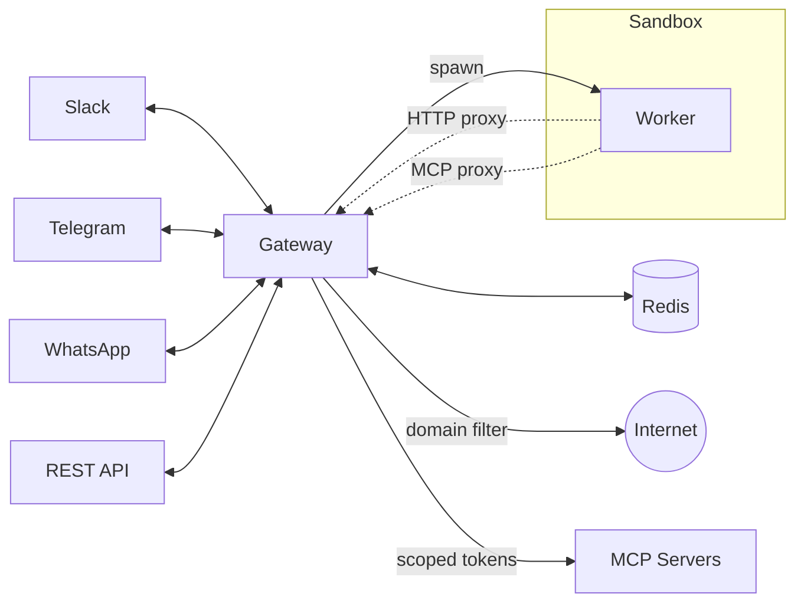

# Lobu


Multi-tenant, sandboxed agent orchestration. Run OpenClaw behind a hardened gateway with MCP proxy, multi-provider auth, and per-context isolation.

**Batteries included.** Lobu bundles sandboxed execution, MCP proxy with OAuth, and network isolation — no external sandbox providers, no third-party MCP gateways. One deployment, everything included.

## Interfaces

**Slack** — Multi-channel/DM agents.

[](https://community.lobu.ai/slack/install) [](https://join.slack.com/t/peerbot/shared_invite/zt-391o8tyw2-iyupjTG1xHIz9Og8C7JOnw)

**Telegram** — Personal AI assistants.

[](https://t.me/lobuaibot)

**REST API** — Programmatic agent creation.

[](https://community.lobu.ai/api/docs)

**WhatsApp** — Baileys-based integration with self-chat mode for testing.

## Quick Start

### New project (recommended)

```bash
npx create-lobu my-bot
cd my-bot && docker compose up -d
```

The wizard guides you through platform setup (Telegram, Slack, or API-only), credentials, MCP servers, and network configuration.

### Deployment modes

- **Docker Compose** — `docker compose up` (production single-machine)
- **Kubernetes** — `helm upgrade --install lobu charts/lobu/ -f charts/lobu/values.yaml` (production cluster)
- **Local** — `cd packages/gateway && bun run dev` (development, workers as child processes)

## Architecture



### Key Concepts

**Gateway as single egress.** All worker traffic — internet and MCP — routes through the gateway. Workers have no direct network access. Domain filtering controls which external services workers can reach.

**MCP Proxy.** Workers call MCP tools via the gateway. The gateway handles OAuth, injects scoped tokens, and resolves `${env:VAR}` secrets. Workers never see client secrets.

**Multi-platform, multi-tenant.** One bot instance serves Slack, Telegram, WhatsApp, and REST API. Each channel/DM gets its own isolated runtime, model, tools, credentials, and Nix packages.

**OpenClaw runtime.** Workers run [OpenClaw Pi Agent](https://openclaw.ai/), with per-agent model selection via the settings page. Supports OpenClaw skills, `IDENTITY.md`, `SOUL.md`, and `USER.md` workspace files.

**Multi-provider auth.** Claude (OAuth), ChatGPT (device-code flow), and API-key providers (Gemini, NVIDIA, etc.) via pluggable `ModelProviderModule`.

**Built-in tools.** User interaction, file sharing, reminders, channel history, and TTS.

## How Lobu Differs

This project started in **July 2025** and was first published under [peerbot.ai](https://peerbot.ai). After OpenClaw was released, I added its runtime as the primary agent runtime — Lobu has its own gateway system that replaces the OpenClaw gateway.

| | Lobu | OpenClaw |
|---|---|---|
| **Scale to zero** | Workers scale down when idle | Requires always-on computer |
| **Multi-tenant** | Single bot, per-channel/DM isolation | One instance per setup |
| **Multi-platform** | Slack, Telegram, WhatsApp, REST API | [15+ chat platforms](https://openclaw.ai/integrations) |
| **Runtime** | OpenClaw Pi Agent via gateway | OpenClaw standalone |
| **User onboarding** | Configure page with OAuth login per provider | CLI setup required |
| **MCP access** | Proxied through gateway, secrets isolated | Direct from agent |
| **Network isolation** | Workers sandboxed, domain-filtered egress | No built-in isolation |
| **Deployment** | K8s, Docker, Local (sandbox runtime) | Single node |

## Security and Privacy

- **No direct worker egress** — all traffic through gateway proxy ([details](docs/SECURITY.md#network-egress))
- **Secrets stay in gateway** — MCP OAuth, provider creds, `${env:}` substitution ([details](docs/SECURITY.md#mcp-oauth-and-credentials))
- **Defense-in-depth on K8s** — NetworkPolicies, RBAC, optional gVisor/Kata runtimes ([details](docs/SECURITY.md#kubernetes))
- **Nix system packages** — per-agent reproducible tooling via settings page ([details](docs/SECURITY.md#skills-and-policy))
- **Skills policy enforcement** ([details](docs/SECURITY.md#skills-and-policy))

## License

Business Source License 1.1 (`BUSL-1.1`). See [LICENSE](LICENSE).

---

Follow along: https://x.com/bu7emba
